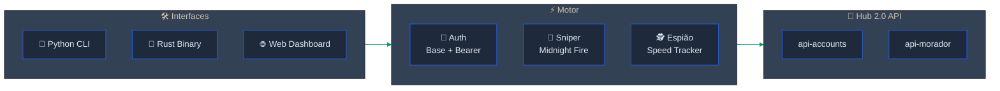
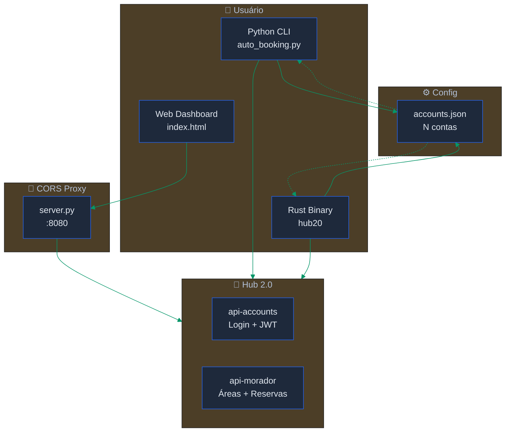

<div align="center">


[](https://python.org)
[](https://rust-lang.org)
[](./index.html)
[](.)
[](./LICENSE)

---

*"Quem reserva por API não espera app carregar."* — Hub 2.0

</div>

---

> [!IMPORTANT]
> **Isto é uma ferramenta de automação pessoal.** Interage com a API do Hub 2.0 (Hubert)
> para reservar espaços de condomínio de forma direta — sem o app lento, sem crash à meia-noite,
> sem ficar recarregando tela. Três interfaces: Python CLI, Rust binary, e Web dashboard.

---

## 🎯 Overview



| Propriedade | Valor |
|:------------|:------|
| **APIs** | `api-accounts.hubert.com.br` · `api-morador.hubert.com.br` |
| **Auth** | `Base <base64(cpf:senha)>` → Bearer JWT |
| **Contas** | N contas simultâneas (reserva + consulta) |
| **Sniper** | Disparo automático à meia-noite com refresh de token |
| **Espião** | Identifica quem reserva nos primeiros 30s (⚡ SPEED) |
| **Interfaces** | Python CLI · Rust 2.3MB binary · HTML + proxy |

---

## ⚡ Quick Start

```bash
git clone git@github.com:gabrielmaialva33/hub20.git && cd hub20
cp accounts.example.json accounts.json   # edite com suas credenciais
```

Escolha sua interface:

```bash
# 🐍 Python — menu interativo
pip install requests
python3 auto_booking.py

# 🦀 Rust — binário nativo (2.3MB)
cd hub20-cli && cargo build --release
./target/release/hub20

# 🌐 Web — dashboard no navegador
python3 server.py    # abre http://localhost:8080
```

<details>
<summary><strong>📋 Pré-requisitos</strong></summary>

| Ferramenta | Versão | Pra quê |
|:-----------|:-------|:--------|
| Python | `>= 3.10` | CLI + proxy server |
| Rust | `>= 1.75` | Binary (opcional) |
| requests | qualquer | Dep do Python CLI |

</details>

---

## 📖 Tutorial de Uso

### 1. Configurar contas

Edite `accounts.json` com suas credenciais:

```json
[
  {
    "label": "Principal",
    "cpf": "000.000.000-00",
    "senha": "sua_senha",
    "condominio": 2078,
    "unidade": "3 083"
  },
  {
    "label": "Consulta",
    "cpf": "111.111.111-11",
    "senha": "outra_senha",
    "condominio": 2078,
    "unidade": "3 083"
  }
]
```

> **💡 Por que N contas?** Quando você tem reserva ativa em uma área, o Hub bloqueia a
> consulta de horários naquela área. Com uma segunda conta, você consulta sem bloqueio
> e reserva com a principal.

### 2. Descobrir espaços disponíveis

```bash
python3 auto_booking.py --listar
```

Isso mostra todas as áreas do condomínio com código e tipo:

```
   11  Churrasqueira 01 c/ Piscina
   17  Quadra de Areia
   22  Cinema
   25  Home Theater
  695  Garage Band
  ...
```

Anote o **código** da área que quer reservar.

### 3. Ver horários disponíveis

```bash
# Area 17, daqui 7 dias
python3 auto_booking.py --area 17 --data 2026-04-03
```

```
  📅 Area 17 — 2026-04-03

    1. ✅ 07:00 - 08:00  (1 vaga)
    2. ✅ 08:00 - 09:00  (1 vaga)
    3. ❌ 20:00 - 21:00  (0 vagas)  ← já pegaram
```

### 4. Reservar direto

```bash
python3 auto_booking.py --area 17 --data 2026-04-03 --hora 20:00
```

### 5. 🎯 Modo Sniper (o mais importante)

O sniper espera até a meia-noite e **dispara a reserva no milissegundo** que o horário abre:

```bash
# Reservar Quadra de Areia (17) dia 03/04, horário das 20h
# Disparo à meia-noite
python3 auto_booking.py --sniper --area 17 --data 2026-04-03 --hora 20:00
```

O que acontece:
1. Faz login e guarda o token
2. Mostra countdown até 00:00:00
3. **5 segundos antes** renova o token (pra não expirar)
4. No milissegundo exato, dispara até 10 tentativas em rajada
5. Se alguém foi mais rápido → mostra "💀 Já pegaram!"

```
  🎯 MODO SNIPER ATIVADO
  📍 Area 17 | 📅 2026-04-03 20:00
  👤 Principal (Marlon)
  ⏰ Disparo as 00:00:00

  ⏱️  00:00:03

  🚀 DISPARANDO! [00:00:00.002]
  ✅ RESERVA CONFIRMADA as 00:00:00.089!
  📋 Codigo: 1332456
```

### 6. 🕵️ Modo Espião

Veja quem reservou e **quando** — identifique quem tá usando automação:

```bash
python3 auto_booking.py --espiao 2026-04-03
```

```
  🕵️  MODO ESPIAO — reservas para 2026-04-03

  2026-03-27T00:00:00.933  Quadra de Areia    20:00-21:00  Fulano       3 042  ⚡ SPEED
  2026-03-27T00:00:01.204  Churrasqueira 01   11:00-12:00  Ciclano      2 015  ⚡ SPEED
  2026-03-27T00:00:45.891  Cinema             20:00-21:00  Beltrano     1 023  🏎️ RAPIDO
  2026-03-27T08:15:33.442  Home Theater       14:00-15:00  Outro        5 101

  🏎️  3 reservas nos primeiros 60 segundos!
  Mais rapido: 2026-03-27T00:00:00.933
```

### 7. Usar com outra conta

```bash
# Consultar horários com a conta 2 (quando a 1 tá bloqueada)
python3 auto_booking.py --conta 2 --area 17 --data 2026-04-03

# Reservar com a conta 1
python3 auto_booking.py --conta 1 --area 17 --data 2026-04-03 --hora 20:00
```

### 8. Gerenciar reservas

```bash
# Ver minhas reservas ativas
python3 auto_booking.py --minhas

# Cancelar uma reserva
python3 auto_booking.py --cancelar 1332456
```

---

## 🏗️ Arquitetura



| Camada | Arquivo | Função |
|:-------|:--------|:-------|
| **Python CLI** | `auto_booking.py` | Menu interativo + flags CLI, N contas, sniper, espião |
| **Rust Binary** | `hub20-cli/` | Mesmo feature set, binário nativo 2.3MB |
| **Web Dashboard** | `index.html` | Interface visual com countdown, requer proxy |
| **CORS Proxy** | `server.py` | Proxy local pra browser (API não tem CORS headers) |
| **Config** | `accounts.json` | Credenciais das N contas (gitignored) |

---

## 🦀 Rust Binary

Binário único de 2.3MB — sem Python, sem Node, sem dependências.

```bash
cd hub20-cli
cargo build --release
./target/release/hub20              # menu interativo
./target/release/hub20 listar       # listar áreas
./target/release/hub20 sniper 17 2026-04-03 --hora 20:00
./target/release/hub20 espiao 2026-04-03
```

**macOS** — roda o script de build no Mac:

```bash
chmod +x build-macos.sh && ./build-macos.sh
```

O script instala Rust automaticamente se necessário.

---

## 🌐 Web Dashboard

Interface visual com tema escuro, countdown do sniper, e espião integrado.

```bash
python3 server.py    # inicia proxy em :8080
# abre http://localhost:8080
```

| Feature | Descrição |
|:--------|:----------|
| **Login** | 2 contas com seletor |
| **Espaços** | Lista com botão "Selecionar" → preenche sniper |
| **Horários** | Vagas em tempo real com botão "🎯 Sniper" |
| **Sniper** | Countdown visual 5em tamanho grande, disparo automático |
| **Minhas** | Reservas ativas com botão cancelar |
| **Espião** | Tabela com badges ⚡ SPEED e 🏎️ RÁPIDO |

---

## 📡 API Reference

| Método | Endpoint | Função |
|:-------|:---------|:-------|
| `POST` | `/api/v1/login` | Auth → retorna JWT |
| `GET` | `/api/v1/areas?codigoCondominio=N` | Listar áreas |
| `GET` | `/api/v1/areas/{id}/datasDisponiveis` | Horários + vagas |
| `POST` | `/api/v1/reservas` | Criar reserva |
| `POST` | `/api/v1/reservas/{id}/cancelar` | Cancelar reserva |
| `GET` | `/api/v1/reservas` | Todas as reservas (IDOR) |

<details>
<summary><strong>Body da reserva</strong></summary>

```json
{
  "codigoArea": 17,
  "codigoCondominio": 2078,
  "unidade": "3 083",
  "quantPessoas": 1,
  "dataReserva": [
    {
      "dataInicial": "2026-04-03T20:00:00",
      "dataFinal": "2026-04-03T21:00:00"
    }
  ],
  "observacoes": ""
}
```

> **⚠️ Datas sem "Z"** — a API espera horário local, não UTC.
> `2026-04-03T20:00:00` ✅ · `2026-04-03T20:00:00.000Z` ❌

</details>

---

## 📊 Status

| Feature | Python | Rust | Web |
|:--------|:------:|:----:|:---:|
| Multi-conta (N) | ✅ | ✅ | ✅ (2) |
| Listar áreas | ✅ | ✅ | ✅ |
| Ver horários | ✅ | ✅ | ✅ |
| Reservar | ✅ | ✅ | via Sniper |
| Sniper midnight | ✅ | ✅ | ✅ |
| Cancelar | ✅ | ✅ | ✅ |
| Espião + badges | ✅ | ✅ | ✅ |
| Token auto-refresh | ✅ | ✅ | ✅ |
| Config persistente | ✅ | ✅ | — |
| Cross-platform | ✅ | ✅ | ✅ |

---

<div align="center">

**Star se você também sofre com o app do condomínio ⭐**

[](https://github.com/gabrielmaialva33/hub20)

*Built by [Gabriel Maia](https://github.com/gabrielmaialva33)*


</div>
